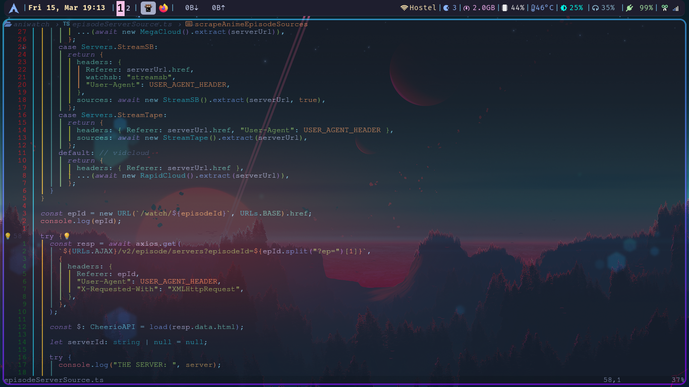
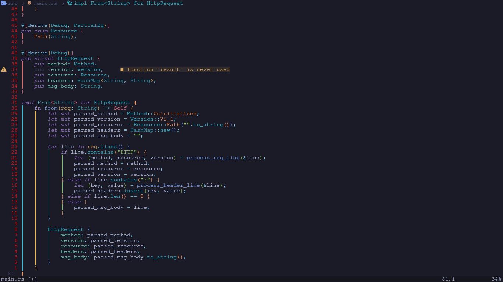
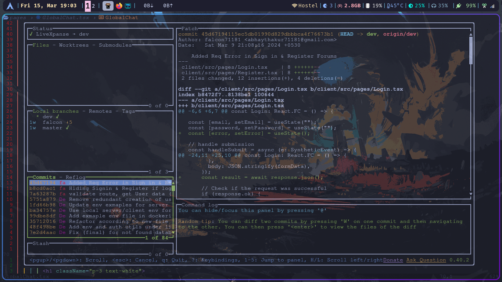
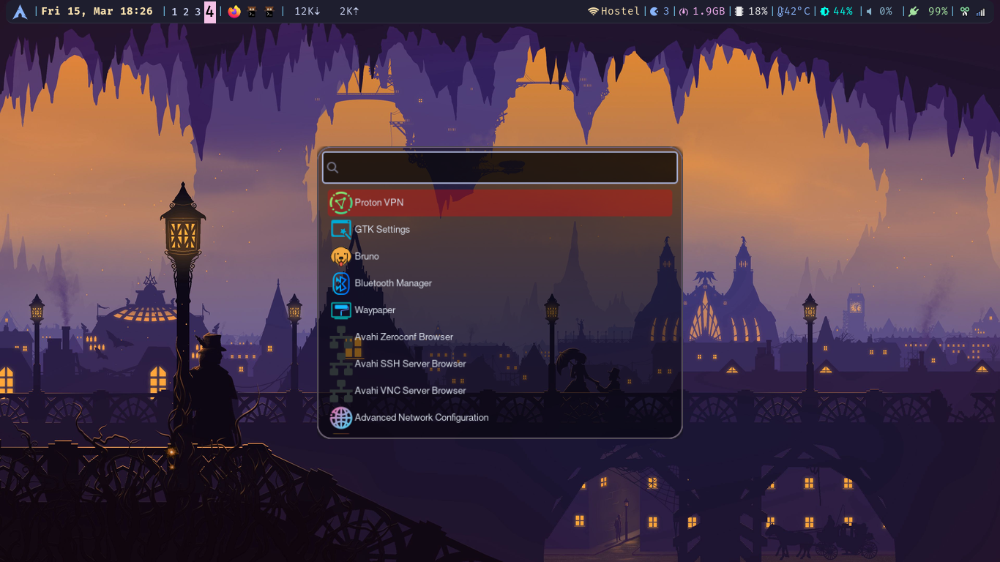
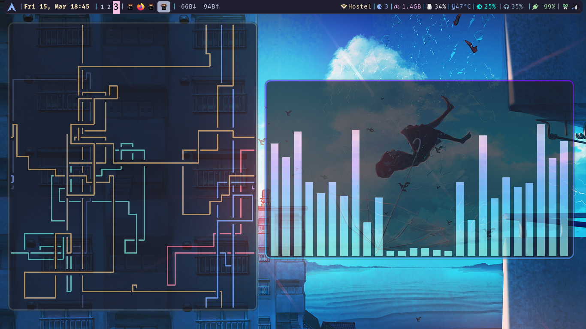
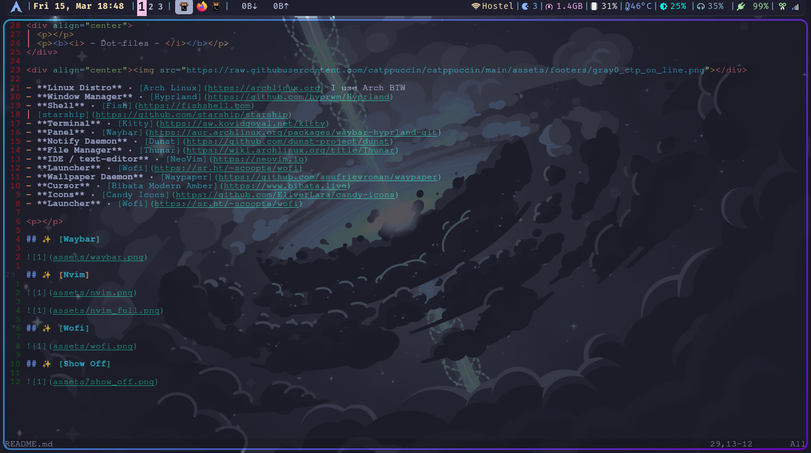
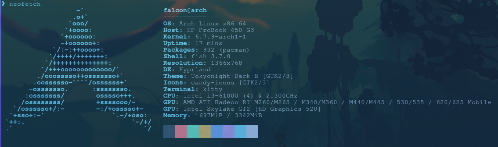

  

  
<b><i> ~ Dot-files ~ </i></b>

- **Linux Distro** • [Arch Linux](https://archlinux.org) I use Arch BTW
- **Window Manager** • [Hyprland](https://github.com/hyprwm/Hyprland)
- **Shell** • [Fish](https://fishshell.com)
  [starship](https://github.com/starship/starship)
- **Terminal** • [Kitty](https://sw.kovidgoyal.net/kitty)
- **Panel** • [Waybar](https://aur.archlinux.org/packages/waybar-hyprland-git)
- **Notify Daemon** • [Dunst](https://github.com/dunst-project/dunst)
- **File Manager** • [Thunar](https://wiki.archlinux.org/title/Thunar)
- **IDE / text-editor** • [NeoVim](https://neovim.io)
- **Launcher** • [Wofi](https://sr.ht/~scoopta/wofi)
- **Wallpaper Daemon** • [Waypaper](https://github.com/anufrievroman/waypaper)
- **Cursor** • [Bibata Modern Amber](https://www.bibata.live)
- **Theme** • [Tokyonight-Dark-B](https://aur.archlinux.org/packages/tokyonight-gtk-theme-git)
- **Icons** • [Candy Icons](https://github.com/EliverLara/candy-icons)
- **Launcher** • [Wofi](https://sr.ht/~scoopta/wofi)

## ✨ [Waybar]

## ✨ [Nvim]

## ✨ [Wofi]

## ✨ [Show Off]

